<div align="center">

# Geometry DSL

**为 AI agent 而生的确定性几何绘图语言。**
文本输入,精确的数学几何图输出。校验 → 渲染 → 看图 → 修复:一个 LLM 真正能跑通的闭环。

[English](README.md) | 简体中文

[](LICENSE)
[](https://nodejs.org)
[](package.json)
[](https://agentskills.io)

<br><br>

<a href="examples/seed-of-life.geom">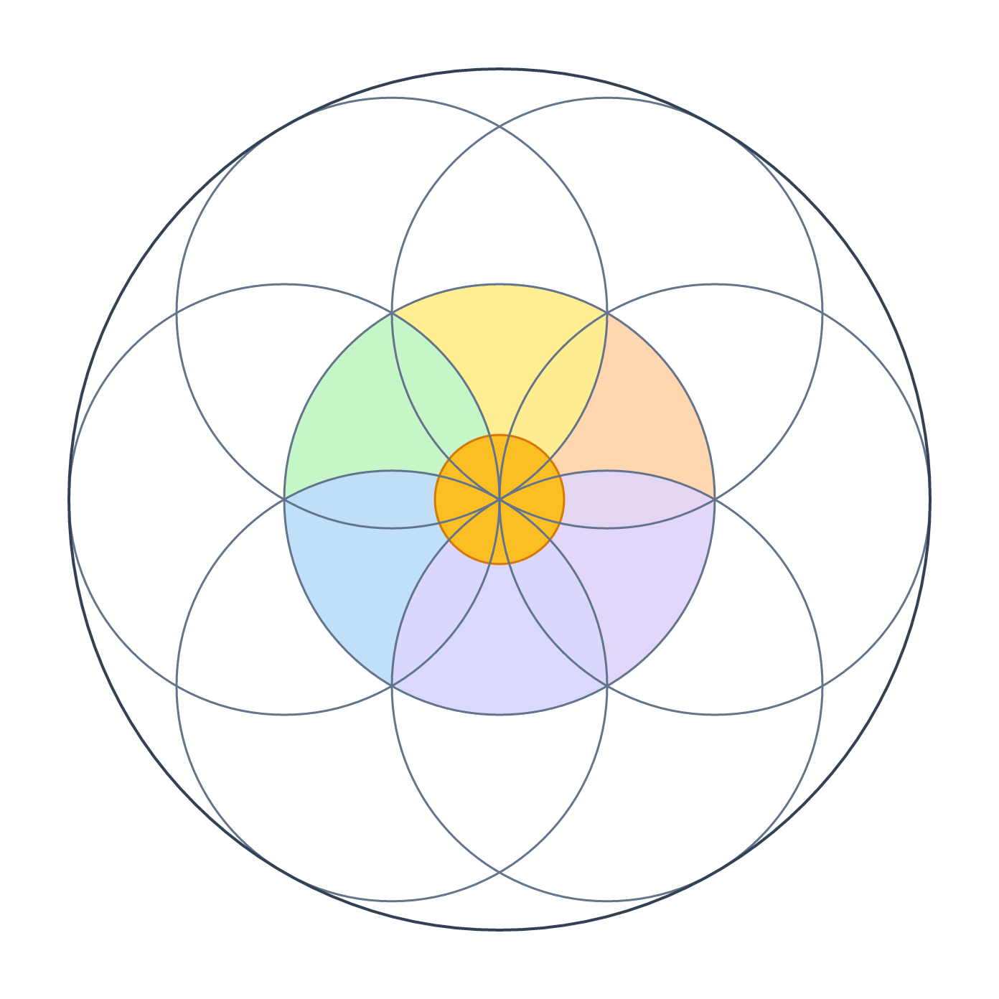</a>
&nbsp;&nbsp;
<a href="examples/pythagoras.geom">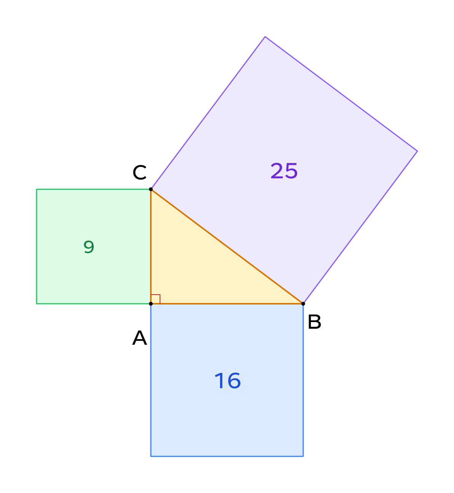</a>

*本页所有图都由一段简短的 `.geom` 文件编译而成 —— 点击任意图片即可查看源码。*

</div>

---

LLM 能理解几何题,但写不好裸 SVG 坐标和 TikZ。Geometry DSL 是中间的这一层:agent 用简短的高层构造(`intersect`、`project`、`along`、布尔区域)描述图形,零依赖编译器产出精确的 SVG/PNG,并给出**稳定的、机器可读的错误码**。agent 可以在交付给用户之前完成校验、渲染、**亲自看图**、修复的完整闭环。

```geometry
A = point(-3, -2, label_pos=below_left)
B = point(3, -2, label_pos=below_right)
C = point(0, 3, label_pos=above)
AB = line(A, B, color=blue, width=2)
BC = line(B, C, color=blue, width=2)
CA = line(C, A, color=blue, width=2)
F = project(C, AB, color=red, label_pos=below)
altitude = line(C, F, dashed=true, color=red)
circumcircle = circle(A, B, C, color=gray, width=1.5)
mark(right, C, F, A, color=red)
```

<div align="center">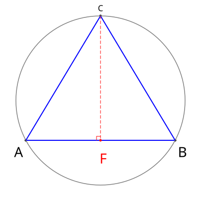</div>

## 为什么不用 SVG、TikZ 或 Mermaid?

| | 裸 SVG / Canvas | TikZ / Asymptote | Mermaid | **Geometry DSL** |
|---|---|---|---|---|
| 适合 LLM 生成 | ❌ 坐标泥潭 | ⚠️ 强大但易错 | ✅ | ✅ |
| 几何语义(求交、投影、角平分线) | ❌ | ✅ | ❌ | ✅ |
| 确定性输出(字节级一致) | — | ⚠️ | ❌ | ✅ |
| 供自我修复的结构化错误码 | ❌ | ❌ TeX 日志 | ❌ | ✅(`E_LAYOUT`,含行列号) |
| 布尔区域 + 自动标签布局 | 手动 | 手动 | ❌ | ✅ |
| 运行时依赖 | — | TeX 发行版 | JS bundle | **0** |

## 特性

- 🎯 **几何优先的原语** —— 点、线段/射线/直线、圆、弧、路径、投影、求交、变换、语义标记(直角、等长、等角、平行)
- 🧩 **真正的布尔区域** —— `inside` / `union` / `intersection` / `difference` 以精确圆弧边界渲染,绝不离散成多边形
- 🏷️ **自动标签布局** —— 点标签、自由文字、区域内文字共用一套确定性避让引擎;`text(region, "...")` 自动选择区域内最净空的位置
- 🔁 **为 agent 闭环设计** —— 稳定错误码含行列号、输出字节级确定,校验 → 渲染 → 看图 → 修复流程内置在随附的 skill 中
- 📦 **零运行时依赖** —— 纯 TypeScript 内核,可跑在 Node、浏览器和 Markdown 管线中
- 🖼️ **SVG + PNG 输出** —— 原生 SVG;PNG 通过 `@resvg/resvg-js`(可选)或系统工具
- 🤖 **本身就是一个 Agent Skill** —— 支持 Claude Code、OpenAI Agents 及任何兼容 Agent Skills 的主机

## 图例

| **五角星** —— `intersect` 求出黄金分割点 | **欧拉线** —— O、G、H 三点共线 | **斐波那契螺旋** —— 精确衔接的四分之一圆弧 |
|:---:|:---:|:---:|
| [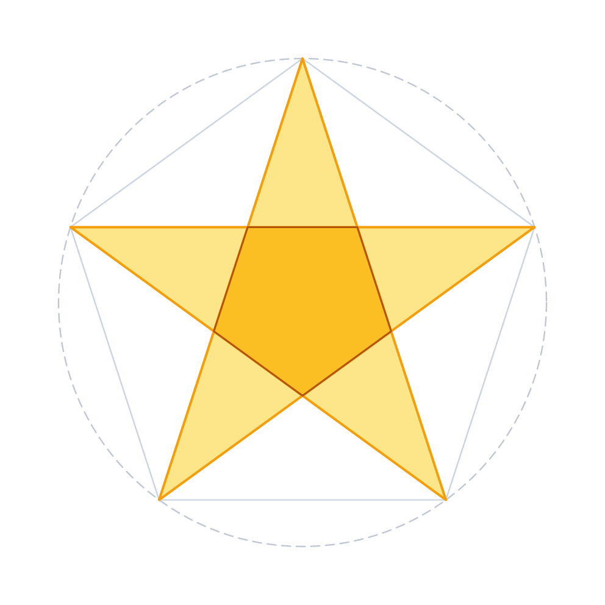](examples/pentagram.geom) | [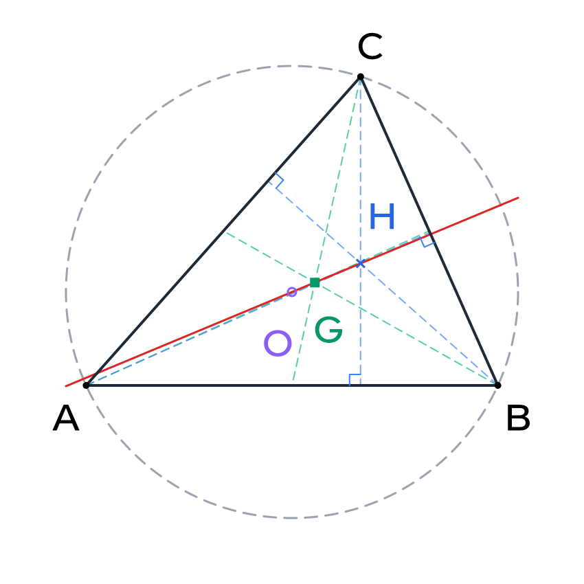](examples/euler-line.geom) | [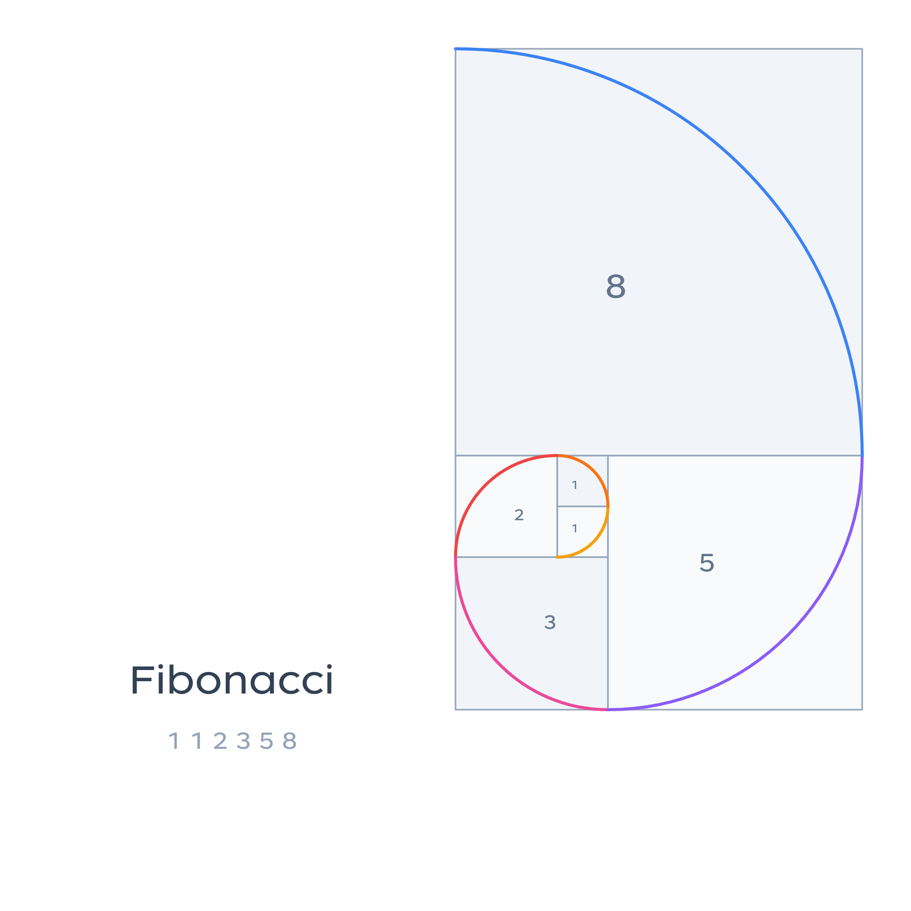](examples/fibonacci-spiral.geom) |
| **内切圆** —— 角平分线 + 相切标记 | **布尔区域** —— 精确圆弧边界 | **四叶曲线** —— 变换与标记 |
| [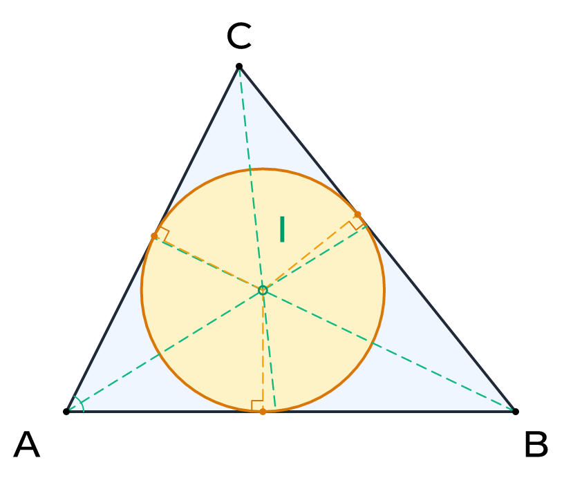](examples/incircle.geom) | [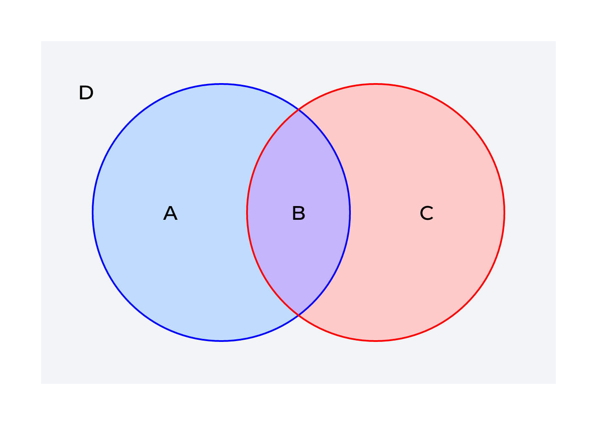](examples/regions.geom) | [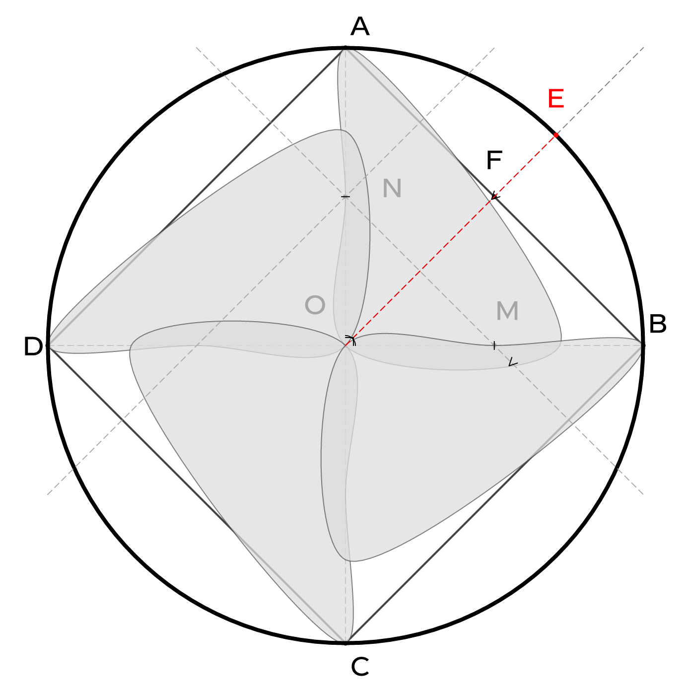](examples/four-leaf.geom) |
| **垂心圆** | **三集合韦恩图** | **空间线框** |
| [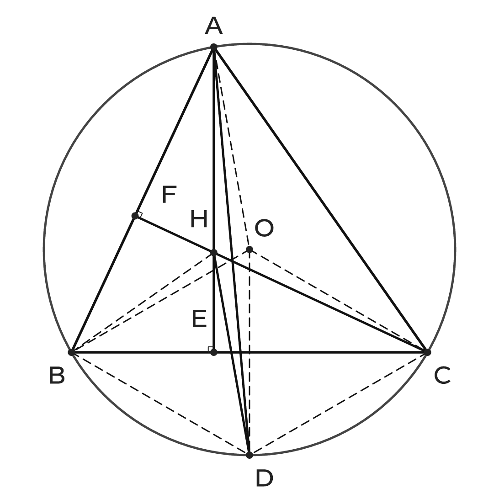](examples/orthocenter-circle.geom) | [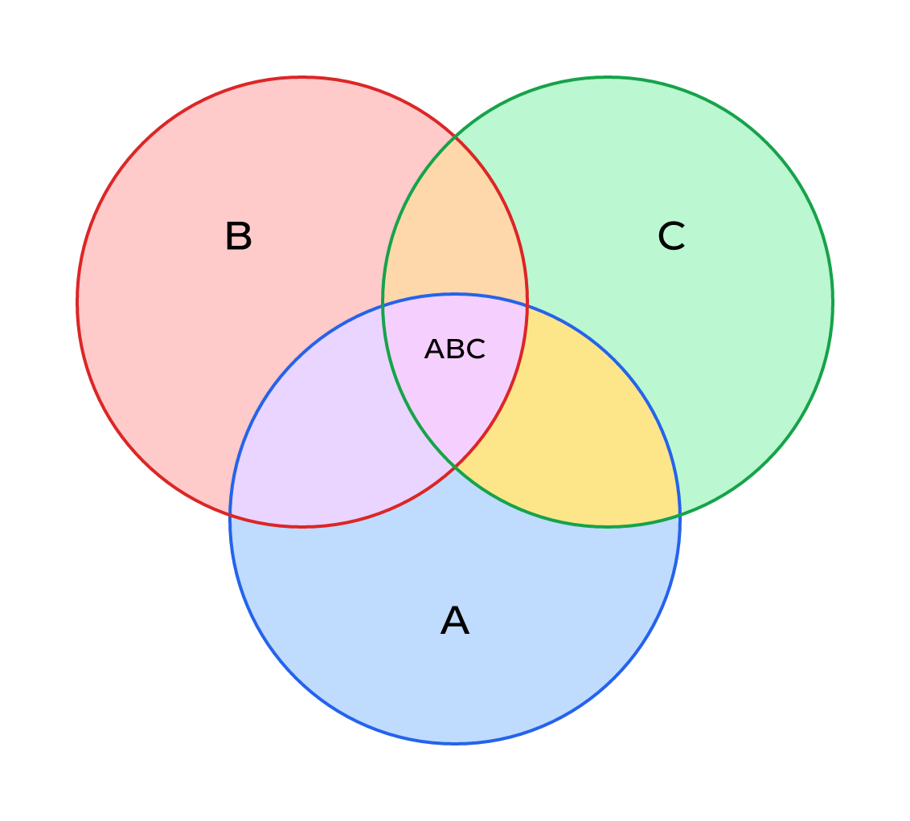](examples/venn.geom) | [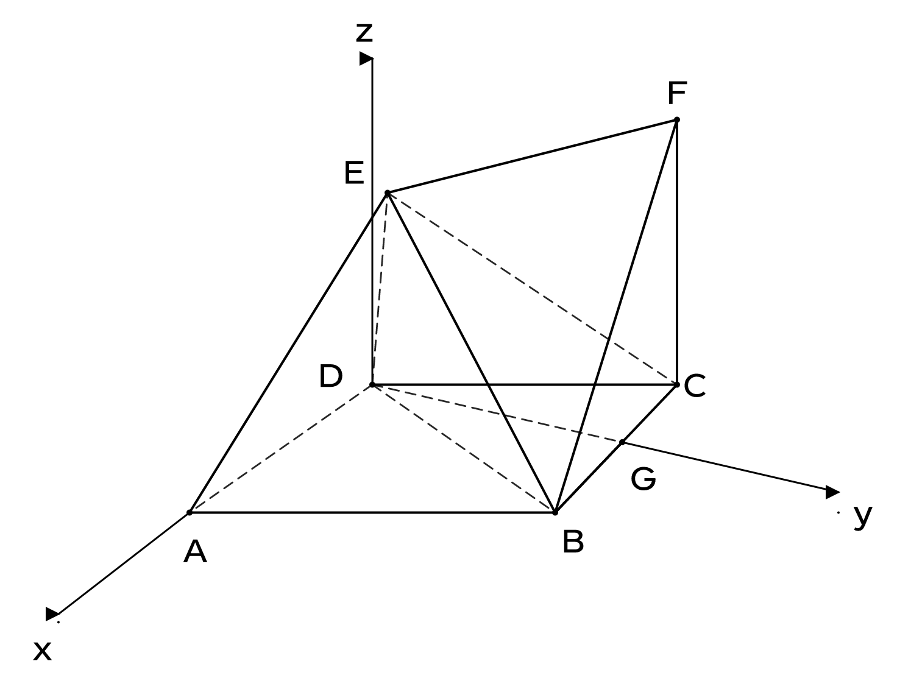](examples/space_wireframe.geom) |

更多见 [`examples/`](examples/)。

## 快速开始

需要 Node.js ≥ 22.18(可直接运行 TypeScript)。

```bash
npm install
npm run build

# CLI:编译 .geom → SVG
node dist/cli.js examples/four-leaf.geom -o four-leaf.svg

# 校验 + 渲染 PNG
node scripts/validate_geometry.mjs examples/four-leaf.geom
node scripts/render_geometry.mjs examples/four-leaf.geom --out four-leaf.png
```

库接口:

```ts
import { parse, evaluate, renderSvg, compileToSvg } from "@geometry-dsl/renderer";

const svg = compileToSvg(source);                 // 一步完成
// 或:parse(source) → evaluate(ast) → renderSvg(scene, { width, height })
```

所有失败抛出 `GeometryDslError`,包含稳定错误码、行号、列号和原因。

## 作为 agent skill 使用

**本仓库即是 skill。** 根目录的 [`SKILL.md`](SKILL.md) 遵循 [Agent Skills](https://agentskills.io) 规范:它教会 agent 这门语言以及校验 → 渲染 → 看图 → 修复的工作流,并指向内置的 [`scripts/`](scripts/)。

### 一句话安装

直接对你的 agent 说:

> **"帮我安装这个 skill:https://github.com/shand001/geometry-dsl.git"**

Claude Code、Codex 或任何兼容 Agent Skills 的 agent 会把它 clone 到自己的 skills 目录(如 `~/.claude/skills/geometry-dsl`)——脚本在 Node.js ≥ 22.18 上直接运行 TypeScript 编译器源码,**无需构建,开箱即用**。然后直接说:*"画一个锐角三角形的垂心构图"*,agent 会写 DSL、校验、渲染、检查图片,最后把 PNG 交给你。

### 手动安装

```bash
git clone https://github.com/shand001/geometry-dsl.git ~/.claude/skills/geometry-dsl
# 可选但推荐:构建 dist/ 并启用 resvg PNG 后端
cd ~/.claude/skills/geometry-dsl && npm install && npm run build
```

**OpenAI Agents:** 适配文件在 [`agents/openai.yaml`](agents/openai.yaml)。脚本按以下顺序自动定位编译器:仓库 `dist/` → 仓库 `src/`(Node ≥ 22.18)→ `GEOMETRY_DSL_MODULE` 环境变量 → 已安装的 npm 包。

## 语言速览

15 个正交核心函数:

```text
point  along  line  circle  arc  path
project  intersect  transform  mark
text  inside  union  intersection  difference
```

- **语义精确** —— 线段、射线、无限直线是不同的对象,不是显示选项;`intersect` 尊重对象的实际范围
- **定义即不可变** —— 名称只定义一次,其余一切用 `along`、`project`、`intersect`、`transform` 推导
- **会验证的标记** —— `mark(right, A, B, C)` 先确认角真的是 90° 才画符号;画错了会大声报错,而不是悄悄说谎

完整语言协议:[docs/spec.md](docs/spec.md)。
面向 skill 的参考手册:[references/language-reference.md](references/language-reference.md)。

## 项目结构

```text
src/language    词法 + 语法分析(纯语法前端)
src/runtime     求值器:名称、类型、重载、样式、Region 表达式
src/geometry    无平台依赖的数值几何与区域内核
src/render      确定性文字布局、Region mask、SVG 输出
src/cli.ts      Node CLI 适配层
SKILL.md        agent skill 入口(Agent Skills 格式)
references/     面向 skill 的语言参考、示例、错误目录、视觉验收
scripts/        skill 使用的 校验 / 渲染 / 文档检查 脚本
examples/       示例 .geom 文件及渲染结果
docs/spec.md    V0.4 语言协议
```

除 `src/cli.ts` 外,核心不含 Node API、DOM 或第三方依赖。

## 开发

```bash
npm run build      # 类型检查 + 输出 dist/
npm test           # node --test(语法、几何、区域、SVG、Markdown、skill 文档)
npm run check:docs # 编译 skill 文档中内嵌的所有几何示例
```

## 参与贡献

欢迎 Issue 和 PR —— 尤其是:语言协议的英文翻译、新的示例图、真实几何题的评测集。提交前请运行 `npm run check && npm run check:docs`。

---

如果 Geometry DSL 帮你的 agent 画出了更好的图,欢迎点一个 ⭐,让更多人发现它。

## 许可证

[MIT](LICENSE) © Geometry DSL contributors
